<div align="center">

```
  ██████╗ ██████╗ ██████╗ ██╗███╗   ██╗ ██████╗     ███████╗██╗  ██╗██╗██╗     ██╗     ███████╗
 ██╔════╝██╔═══██╗██╔══██╗██║████╗  ██║██╔════╝     ██╔════╝██║ ██╔╝██║██║     ██║     ██╔════╝
 ██║     ██║   ██║██║  ██║██║██╔██╗ ██║██║  ███╗    ███████╗█████═╝ ██║██║     ██║     ███████╗
 ██║     ██║   ██║██║  ██║██║██║╚██╗██║██║   ██║    ╚════██║██╔═██╗ ██║██║     ██║     ╚════██║
 ╚██████╗╚██████╔╝██████╔╝██║██║ ╚████║╚██████╔╝    ███████║██║ ╚██╗██║███████╗███████╗███████║
  ╚═════╝ ╚═════╝ ╚═════╝ ╚═╝╚═╝  ╚═══╝ ╚═════╝     ╚══════╝╚═╝  ╚═╝╚═╝╚══════╝╚══════╝╚══════╝
```

### ⚡ APPLIED CODING SKILLS • ALGORITHMIC INTELLIGENCE HUB ⚡
#### *High-Performance Data Structures & Pattern-Driven Competitive Engineering*

<br/>

[](https://leetcode.com/)
[](https://leetcode.com/)
[-ff007f?style=for-the-badge&logo=speedtest&logoColor=fff&labelColor=0d1117)](https://leetcode.com/)
[](https://www.java.com/)

<br/>

> *“Simplicity is prerequisite for reliability. Optimization is the elimination of the unnecessary.”*

```
⚡ [SYSTEM READY] ──► 27 ALGORITHMIC MODULES VERIFIED ──► ZERO-ALLOCATION PATTERNS DEPLOYED ──► 100% PASS RATE
```

<br/>

[🛰️ SYSTEM TELEMETRY](#-system-telemetry--kpi-matrix) • [🧬 NEURAL ROADMAP](#-neural-algorithmic-roadmap) • [🗂️ PROBLEM MATRIX](#-problem-directory--benchmark-vault) • [💎 PATTERN BLUEPRINTS](#-algorithmic-pattern-blueprints) • [🌐 SYSTEM REPO MAP](#-repository-topology)

---

</div>

<br/>

## 🛰️ System Telemetry & KPI Matrix

<div align="center">

| 🔬 Metric Identifier | 🎯 Target Baseline | ⚡ System Achieved | 📈 Health Status |
| :--- | :---: | :---: | :---: |
| **Total Problem Coverage** | `27 Problems` | **`27 / 27 (100.0%)`** |  |
| **🟢 Easy Modules (Tier 1)** | `16 Problems` | **`16 Solved`** |  |
| **🟡 Medium Modules (Tier 2)** | `9 Problems` | **`9 Solved`** |  |
| **🔴 Hard Modules (Tier 3)** | `2 Problems` | **`2 Solved`** |  |
| **Peak Runtime Percentile** | `> 90.0%` | **`0 ms (100.00% Beats)`** |  |
| **Space Complexity Target** | `$O(1)$ Auxiliary` | **Minimal Allocations** |  |

</div>

<br/>

---

## 🧬 Neural Algorithmic Roadmap

The visual schematic below details the multi-phase algorithmic progression across three core memory and pointer paradigms:

```mermaid
flowchart LR
    %% Styles
    classDef phase1 fill:#0f172a,stroke:#38bdf8,stroke-width:2px,color:#f8fafc;
    classDef phase2 fill:#0f172a,stroke:#a855f7,stroke-width:2px,color:#f8fafc;
    classDef phase3 fill:#0f172a,stroke:#ec4899,stroke-width:2px,color:#f8fafc;
    classDef nodeStyle fill:#1e293b,stroke:#64748b,stroke-width:1px,color:#cbd5e1;

    subgraph W1 ["🔷 MODULE 01 // LINEAR VECTORS & POINTER CONVERGENCE"]
        direction TB
        A1["Two-Pointer Partitioning<br/><code>Dutch National Flag O(N)</code>"]:::nodeStyle
        A2["Cumulative Sum Projections<br/><code>Prefix/Suffix Arrays O(1)</code>"]:::nodeStyle
        A3["Subarray Windows & Log Search<br/><code>Sliding Window & Binary Search</code>"]:::nodeStyle
    end

    subgraph W2 ["🟣 MODULE 02 // TOPOLOGICAL LINKAGE & CYCLE DYNAMICS"]
        direction TB
        B1["Floyd's Cycle Vectoring<br/><code>Tortoise & Hare (2x-Speed)</code>"]:::nodeStyle
        B2["In-Place Pointer Inversion<br/><code>O(1) Memory Sublist Reversal</code>"]:::nodeStyle
        B3["Segmented K-Group Reversals<br/><code>Divide & Conquer / Min-Heap Merge</code>"]:::nodeStyle
    end

    subgraph W3 ["🌸 MODULE 03 // LIFO TRANSIENCE & MONOTONIC FILTERS"]
        direction TB
        C1["Monotonic Stack Engines<br/><code>Next Greater / Temperature Spans</code>"]:::nodeStyle
        C2["Deterministic Bracket Balancers<br/><code>Two-Pass State Filters</code>"]:::nodeStyle
        C3["Collision & Sequence Simulation<br/><code>LIFO Event Horizon Sim</code>"]:::nodeStyle
    end

    W1 ==>|Pointer Dynamics| W2
    W2 ==>|State Transition| W3

    class W1 phase1;
    class W2 phase2;
    class W3 phase3;
```



<br/>

---

## 🗂️ Problem Directory & Benchmark Vault

### 🔷 Module 01: Arrays, Strings, Two Pointers & Binary Search
> **Core Concepts:** 3-Way Partitioning (Dutch National Flag), Running Prefix Arrays, Sliding Window Boundaries, Logarithmic Search Space Reductions.

| # | Problem Identifier | Tier | Core Algorithmic Archetype | Time | Space | Performance (Beats) | Code | Notes |
| :---: | :--- | :---: | :--- | :---: | :---: | :---: | :---: | :---: |
| `0075` | [Sort Colors](https://leetcode.com/problems/sort-colors/) |  | Dutch National Flag (3-Way In-Place) | $\mathcal{O}(N)$ | $\mathcal{O}(1)$ | `⚡ 0 ms (100.00%)` | [Java](Week-1/0075-sort-colors/solution.java) | [README](Week-1/0075-sort-colors/README.md) |
| `0121` | [Best Time to Buy and Sell Stock](https://leetcode.com/problems/best-time-to-buy-and-sell-stock/) |  | Greedy Running Min-Tracking | $\mathcal{O}(N)$ | $\mathcal{O}(1)$ | `⚡ 1 ms (99.96%)` | [Java](Week-1/0121-best-time-to-buy-and-sell-stock/solution.java) | [README](Week-1/0121-best-time-to-buy-and-sell-stock/README.md) |
| `0219` | [Contains Duplicate II](https://leetcode.com/problems/contains-duplicate-ii/) |  | Sliding Window / Spatial Hash Map | $\mathcal{O}(N)$ | $\mathcal{O}(k)$ | `24 ms (71.34%)` | [Java](Week-1/0219-contains-duplicate-ii/solution.java) | [README](Week-1/0219-contains-duplicate-ii/README.md) |
| `0283` | [Move Zeroes](https://leetcode.com/problems/move-zeroes/) |  | Two Pointers (In-place Swap Index) | $\mathcal{O}(N)$ | $\mathcal{O}(1)$ | `⚡ 2 ms (92.03%)` | [Java](Week-1/0283-move-zeroes/solution.java) | [README](Week-1/0283-move-zeroes/README.md) |
| `0344` | [Reverse String](https://leetcode.com/problems/reverse-string/) |  | Dual Opposite-End Convergence | $\mathcal{O}(N)$ | $\mathcal{O}(1)$ | `⚡ 0 ms (100.00%)` | [Java](Week-1/0344-reverse-string/solution.java) | [README](Week-1/0344-reverse-string/README.md) |
| `0387` | [First Unique Character in a String](https://leetcode.com/problems/first-unique-character-in-a-string/) |  | Direct Frequency Array Hash | $\mathcal{O}(N)$ | $\mathcal{O}(1)$ | `31 ms (38.93%)` | [Java](Week-1/0387-first-unique-character-in-a-string/solution.java) | [README](Week-1/0387-first-unique-character-in-a-string/README.md) |
| `0704` | [Binary Search](https://leetcode.com/problems/binary-search/) |  | Logarithmic Search Space Division | $\mathcal{O}(\log N)$ | $\mathcal{O}(1)$ | `⚡ 0 ms (100.00%)` | [Java](Week-1/0704-binary-search/solution.java) | [README](Week-1/0704-binary-search/README.md) |
| `0977` | [Squares of a Sorted Array](https://leetcode.com/problems/squares-of-a-sorted-array/) |  | Two Pointers (Extreme Magnitudes) | $\mathcal{O}(N)$ | $\mathcal{O}(N)$ | `⚡ 1 ms (100.00%)` | [Java](Week-1/0977-squares-of-a-sorted-array/solution.java) | [README](Week-1/0977-squares-of-a-sorted-array/README.md) |
| `1480` | [Running Sum of 1d Array](https://leetcode.com/problems/running-sum-of-1d-array/) |  | Prefix Accumulator Vector | $\mathcal{O}(N)$ | $\mathcal{O}(1)$ | `⚡ 0 ms (100.00%)` | [Java](Week-1/1480-running-sum-of-1d-array/solution.java) | [README](Week-1/1480-running-sum-of-1d-array/README.md) |
| `1685` | [Sum of Absolute Differences in Sorted Array](https://leetcode.com/problems/sum-of-absolute-differences-in-a-sorted-array/) |  | Prefix & Suffix Equilibrium Balance | $\mathcal{O}(N)$ | $\mathcal{O}(1)$ | `⚡ 4 ms (85.17%)` | [Java](Week-1/1685-sum-of-absolute-differences-in-a-sorted-array/solution.java) | [README](Week-1/1685-sum-of-absolute-differences-in-a-sorted-array/README.md) |

<br/>

### 🟣 Module 02: Linked Lists & Pointer Manipulation
> **Core Concepts:** Floyd's Cycle Detection Protocol, Pointer Inversion, Segmented K-Group Transformations, Priority-Queue K-Way Merge.

| # | Problem Identifier | Tier | Core Algorithmic Archetype | Time | Space | Performance (Beats) | Code | Notes |
| :---: | :--- | :---: | :--- | :---: | :---: | :---: | :---: | :---: |
| `0021` | [Merge Two Sorted Lists](https://leetcode.com/problems/merge-two-sorted-lists/) |  | In-Place Pointer Splice Merge | $\mathcal{O}(N + M)$ | $\mathcal{O}(1)$ | `⚡ 0 ms (100.00%)` | [Java](Week-2/0021-merge-two-sorted-lists/solution.java) | [README](Week-2/0021-merge-two-sorted-lists/README.md) |
| `0023` | [Merge k Sorted Lists](https://leetcode.com/problems/merge-k-sorted-lists/) |  | Min-Heap / K-Way Priority Merge | $\mathcal{O}(N \log k)$ | $\mathcal{O}(k)$ | `5 ms (40.75%)` | [Java](Week-2/0023-merge-k-sorted-lists/solution.java) | [README](Week-2/0023-merge-k-sorted-lists/README.md) |
| `0025` | [Reverse Nodes in k-Group](https://leetcode.com/problems/reverse-nodes-in-k-group/) |  | Segmented In-Place Sublist Reversal | $\mathcal{O}(N)$ | $\mathcal{O}(1)$ | `⚡ 1 ms (34.55%)` | [Java](Week-2/0025-reverse-nodes-in-k-group/solution.java) | [README](Week-2/0025-reverse-nodes-in-k-group/README.md) |
| `0142` | [Linked List Cycle II](https://leetcode.com/problems/linked-list-cycle-ii/) |  | Floyd's Phase-2 Collision Alignment | $\mathcal{O}(N)$ | $\mathcal{O}(1)$ | `⚡ 0 ms (100.00%)` | [Java](Week-2/0142-linked-list-cycle-ii/solution.java) | [README](Week-2/0142-linked-list-cycle-ii/README.md) |
| `0160` | [Intersection of Two Linked Lists](https://leetcode.com/problems/intersection-of-two-linked-lists/) |  | Cross-Traversing Path Alignment | $\mathcal{O}(N + M)$ | $\mathcal{O}(1)$ | `⚡ 1 ms (99.90%)` | [Java](Week-2/0160-intersection-of-two-linked-lists/solution.java) | [README](Week-2/0160-intersection-of-two-linked-lists/README.md) |
| `0206` | [Reverse Linked List](https://leetcode.com/problems/reverse-linked-list/) |  | In-Place Directional Pointer Reversal | $\mathcal{O}(N)$ | $\mathcal{O}(1)$ | `⚡ 0 ms (100.00%)` | [Java](Week-2/0206-reverse-linked-list/solution.java) | [README](Week-2/0206-reverse-linked-list/README.md) |
| `0234` | [Palindrome Linked List](https://leetcode.com/problems/palindrome-linked-list/) |  | Fast/Slow Split + Sublist Inversion | $\mathcal{O}(N)$ | $\mathcal{O}(1)$ | `⚡ 3 ms (99.83%)` | [Java](Week-2/0234-palindrome-linked-list/solution.java) | [README](Week-2/0234-palindrome-linked-list/README.md) |
| `0876` | [Middle of the Linked List](https://leetcode.com/problems/middle-of-the-linked-list/) |  | Fast & Slow $2\times$ Velocity Probe | $\mathcal{O}(N)$ | $\mathcal{O}(1)$ | `⚡ 0 ms (100.00%)` | [Java](Week-2/0876-middle-of-the-linked-list/solution.java) | [README](Week-2/0876-middle-of-the-linked-list/README.md) |

<br/>

### 🌸 Module 03: Stacks, Monotonic Stacks & Simulation
> **Core Concepts:** Monotonic Decreasing Stack for Next Greater Elements, Interval Span Compression, Bracket State Filtering, Event Horizons.

| # | Problem Identifier | Tier | Core Algorithmic Archetype | Time | Space | Performance (Beats) | Code | Notes |
| :---: | :--- | :---: | :--- | :---: | :---: | :---: | :---: | :---: |
| `0020` | [Valid Parentheses](https://leetcode.com/problems/valid-parentheses/) |  | LIFO Delimiter Matching Stack | $\mathcal{O}(N)$ | $\mathcal{O}(N)$ | `⚡ 3 ms (86.07%)` | [Java](Week-3/0020-valid-parentheses/solution.java) | [README](Week-3/0020-valid-parentheses/README.md) |
| `0155` | [Min Stack](https://leetcode.com/problems/min-stack/) |  | Dual Stack / Auxiliary State Tracking | $\mathcal{O}(1)$ | $\mathcal{O}(N)$ | `34 ms (61.77%)` | [Java](Week-3/0155-min-stack/solution.java) | [README](Week-3/0155-min-stack/README.md) |
| `0496` | [Next Greater Element I](https://leetcode.com/problems/next-greater-element-i/) |  | Monotonic Decreasing Stack + Hash Map | $\mathcal{O}(N + M)$ | $\mathcal{O}(N)$ | `⚡ 2 ms (99.48%)` | [Java](Week-3/0496-next-greater-element-i/solution.java) | [README](Week-3/0496-next-greater-element-i/README.md) |
| `0735` | [Asteroid Collision](https://leetcode.com/problems/asteroid-collision/) |  | Vector Collision Physics Simulation | $\mathcal{O}(N)$ | $\mathcal{O}(N)$ | `⚡ 5 ms (67.32%)` | [Java](Week-3/0735-asteroid-collision/solution.java) | [README](Week-3/0735-asteroid-collision/README.md) |
| `0739` | [Daily Temperatures](https://leetcode.com/problems/daily-temperatures/) |  | Monotonic Decreasing Index Stack | $\mathcal{O}(N)$ | $\mathcal{O}(N)$ | `71 ms (38.95%)` | [Java](Week-3/0739-daily-temperatures/solution.java) | [README](Week-3/0739-daily-temperatures/README.md) |
| `0901` | [Online Stock Span](https://leetcode.com/problems/online-stock-span/) |  | Monotonic Stack with Span Aggregation | $\mathcal{O}(1)^*$ | $\mathcal{O}(N)$ | `31 ms (60.14%)` | [Java](Week-3/0901-online-stock-span/solution.java) | [README](Week-3/0901-online-stock-span/README.md) |
| `0946` | [Validate Stack Sequences](https://leetcode.com/problems/validate-stack-sequences/) |  | Greedy Push-Pop State Replay | $\mathcal{O}(N)$ | $\mathcal{O}(N)$ | `⚡ 2 ms (88.46%)` | [Java](Week-3/0946-validate-stack-sequences/solution.java) | [README](Week-3/0946-validate-stack-sequences/README.md) |
| `1249` | [Min Remove for Valid Parentheses](https://leetcode.com/problems/minimum-remove-to-make-valid-parentheses/) |  | Index Balance Stack + String Builder Filter | $\mathcal{O}(N)$ | $\mathcal{O}(N)$ | `⚡ 6 ms (97.91%)` | [Java](Week-3/1249-minimum-remove-to-make-valid-parentheses/solution.java) | [README](Week-3/1249-minimum-remove-to-make-valid-parentheses/README.md) |
| `1475` | [Final Prices With Special Discount](https://leetcode.com/problems/final-prices-with-a-special-discount-in-a-shop/) |  | Monotonic Stack (Next Smaller or Equal) | $\mathcal{O}(N)$ | $\mathcal{O}(N)$ | `⚡ 1 ms (99.79%)` | [Java](Week-3/1475-final-prices-with-a-special-discount-in-a-shop/solution.java) | [README](Week-3/1475-final-prices-with-a-special-discount-in-a-shop/README.md) |

<br/>

---

## 💎 Algorithmic Pattern Blueprints

<details>
<summary><b>📐 Blueprint 01: Dutch National Flag & 3-Way Partitioning (Module 01)</b></summary>
<br>

Used when an array needs to be partitioned in-place into three distinct segments (`< pivot`, `== pivot`, `> pivot`) in a single pass $\mathcal{O}(N)$ time with $\mathcal{O}(1)$ auxiliary memory.

```
Initial State:  [ 2 | 0 | 2 | 1 | 1 | 0 ]
                  ▲                   ▲
                 low, mid            high

Invariants Maintained:
  • [0 ... low-1]     == 0 (Red Region)
  • [low ... mid-1]   == 1 (White Region)
  • [mid ... high]    == Unprocessed Region
  • [high+1 ... end]  == 2 (Blue Region)
```

```java
int low = 0, mid = 0, high = nums.length - 1;
while (mid <= high) {
    if (nums[mid] == 0) {
        swap(nums, low++, mid++);
    } else if (nums[mid] == 1) {
        mid++;
    } else {
        swap(nums, mid, high--);
    }
}
```

</details>

<details>
<summary><b>🔄 Blueprint 02: Floyd’s Cycle Vectoring & Fast/Slow Convergence (Module 02)</b></summary>
<br>

Detects cycles and locates exact loop entry nodes without modifying list topology or allocating hash sets.

```
Phase 1: Detection
  Slow advances 1 step (v = 1), Fast advances 2 steps (v = 2).
  Collision guaranteed at k steps within cycle.

Phase 2: Entry Point Localization
  Reset slow to head. Advance both slow and fast at 1 step (v = 1).
  Intersection point == Loop Entry Node.
```

```java
public ListNode detectCycle(ListNode head) {
    ListNode slow = head, fast = head;
    while (fast != null && fast.next != null) {
        slow = slow.next;
        fast = fast.next.next;
        if (slow == fast) {
            ListNode ptr = head;
            while (ptr != slow) {
                ptr = ptr.next;
                slow = slow.next;
            }
            return ptr; // Cycle start identified
        }
    }
    return null; // Acyclic topology
}
```

</details>

<details>
<summary><b>🔁 Blueprint 03: In-Place Segment Reversal & K-Group Chains (Module 02)</b></summary>
<br>

Inverts directional node references iteratively within fixed memory bounds.

```
Before:  (Prev) ──► [Node A] ──► [Node B] ──► [Node C] ──► (Next)
After:   (Prev) ──► [Node C] ──► [Node B] ──► [Node A] ──► (Next)
```

```java
ListNode prev = null, curr = head;
while (curr != null) {
    ListNode next = curr.next;
    curr.next = prev;
    prev = curr;
    curr = next;
}
return prev;
```

</details>

<details>
<summary><b>📉 Blueprint 04: Monotonic Decreasing Stack for Linear Next-Greater Queries (Module 03)</b></summary>
<br>

Resolves next-greater and next-warmer queries in amortized $\mathcal{O}(N)$ time by maintaining strict invariant ordering within the stack.

```
Stream: [ 73, 74, 75, 71, 69, 72, 76, 73 ]
Invariant: Stack strictly stores indices in descending order of value.
Resolution: When a higher value arrives, it pops all smaller predecessors and records their delta.
```

```java
int[] result = new int[temperatures.length];
Deque<Integer> stack = new ArrayDeque<>();

for (int i = 0; i < temperatures.length; i++) {
    while (!stack.isEmpty() && temperatures[i] > temperatures[stack.peek()]) {
        int prevIdx = stack.pop();
        result[prevIdx] = i - prevIdx;
    }
    stack.push(i);
}
return result;
```

</details>

<br/>

---

## 🌐 Repository Topology

```ascii
⚡ APPLIED-CODING-SKILLS-S1L10
├── 📄 README.md                                  # Root Architecture & Performance Index
├── 📁 Week-1/                                    # 🔷 MODULE 01: Arrays, Pointers, Binary Search (10/10)
│   ├── 📄 README.md                              # Module 01 Deep-Dive & Syllabus
│   ├── 📁 0075-sort-colors/                      # 🟡 Medium • Dutch National Flag
│   ├── 📁 0121-best-time-to-buy-and-sell-stock/  # 🟢 Easy   • Greedy Min-Tracking
│   ├── 📁 0219-contains-duplicate-ii/            # 🟢 Easy   • Sliding Window / Hash
│   ├── 📁 0283-move-zeroes/                      # 🟢 Easy   • Two Pointer Swap
│   ├── 📁 0344-reverse-string/                   # 🟢 Easy   • Opposite Pointer Swap
│   ├── 📁 0387-first-unique-character-in-a-string/ # 🟢 Easy • Direct Array Hash
│   ├── 📁 0704-binary-search/                    # 🟢 Easy   • Logarithmic Divide & Conquer
│   ├── 📁 0977-squares-of-a-sorted-array/        # 🟢 Easy   • Two Pointer Extremes
│   ├── 📁 1480-running-sum-of-1d-array/          # 🟢 Easy   • Prefix Array Accumulator
│   └── 📁 1685-sum-of-absolute-differences-in-a-sorted-array/ # 🟡 Medium • Prefix & Suffix Balancer
├── 📁 Week-2/                                    # 🟣 MODULE 02: Linked Lists & Floyd's Cycle (8/8)
│   ├── 📄 README.md                              # Module 02 Deep-Dive & Syllabus
│   ├── 📁 0021-merge-two-sorted-lists/           # 🟢 Easy   • In-Place Pointer Splice
│   ├── 📁 0023-merge-k-sorted-lists/             # 🔴 Hard   • Min-Heap / PriorityQueue
│   ├── 📁 0025-reverse-nodes-in-k-group/         # 🔴 Hard   • Segmented In-Place Inversion
│   ├── 📁 0142-linked-list-cycle-ii/             # 🟡 Medium • Floyd's Phase 2 Collision
│   ├── 📁 0160-intersection-of-two-linked-lists/ # 🟢 Easy   • Cross-Traversing Alignment
│   ├── 📁 0206-reverse-linked-list/              # 🟢 Easy   • Directional Inversion
│   ├── 📁 0234-palindrome-linked-list/           # 🟢 Easy   • Fast/Slow + Half Reverse
│   └── 📁 0876-middle-of-the-linked-list/        # 🟢 Easy   • Fast & Slow 2x Velocity
└── 📁 Week-3/                                    # 🌸 MODULE 03: Stacks & Monotonic Engines (9/9)
    ├── 📄 README.md                              # Module 03 Deep-Dive & Syllabus
    ├── 📁 0020-valid-parentheses/                # 🟢 Easy   • LIFO Bracket Balancer
    ├── 📁 0155-min-stack/                        # 🟡 Medium • Dual-Stack Min Tracker
    ├── 📁 0496-next-greater-element-i/           # 🟢 Easy   • Monotonic Decreasing Stack
    ├── 📁 0735-asteroid-collision/               # 🟡 Medium • Vector Collision Simulation
    ├── 📁 0739-daily-temperatures/               # 🟡 Medium • Monotonic Decreasing Index
    ├── 📁 0901-online-stock-span/                # 🟡 Medium • Monotonic Span Compression
    ├── 📁 0946-validate-stack-sequences/         # 🟡 Medium • Greedy Push-Pop Simulation
    ├── 📁 1249-minimum-remove-to-make-valid-parentheses/ # 🟡 Medium • Index Filter + String Builder
    └── 📁 1475-final-prices-with-a-special-discount-in-a-shop/ # 🟢 Easy • Monotonic Next Smaller Stack
```

<br/>

---

## ⚙️ Compilation & Execution Protocol

All algorithmic solutions are constructed in pure **Java (JDK 8 / 11 / 17 / 21+)** without third-party dependencies.

```bash
# // STEP 1: Navigate to target module directory
$ cd Week-1/0075-sort-colors

# // STEP 2: Compile with standard Java bytecode compiler
$ javac solution.java

# // STEP 3: Execute locally or test against custom harness
$ java Solution
```

<br/>

---

<div align="center">

```
  ┌────────────────────────────────────────────────────────────────────────┐
  │  ⚡ CORE ENGINE INITIALIZED • ZERO DEVIATION • AMORTIZED OPTIMALITY  │
  └────────────────────────────────────────────────────────────────────────┘
```

*Architected with precision for **Applied Coding Skills (S1L10)** • Clean Code • Zero Memory Waste • Maximum Velocity*

</div>